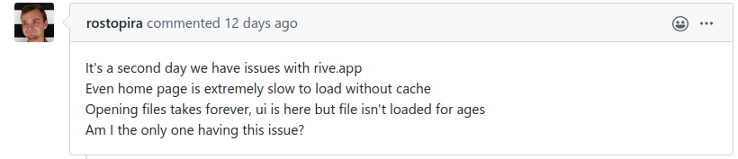
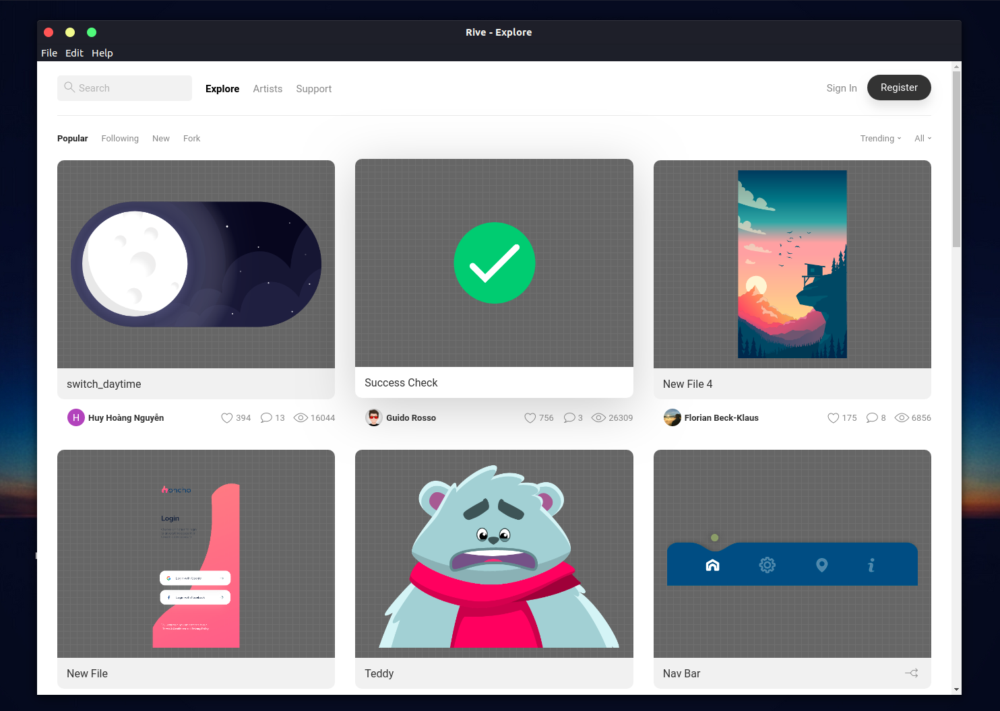

## Desktop application for **rive.app**

I was just checking some random videos on **YouTube** then i found **Rive.** I created a free account and also created a new project. However, I wasn't satisfied due to a lot of reasons but i'll just mention few.

- Performance
- It doesn't have a desktop version.
- Missing some UI/UX Designs/functionalities 
  
## Performance
It was a little bit slow so i made a performance test and the result wasn't good on a 3G network:


and i'm not the only one with the same problem.


[https://github.com/2d-inc/support/issues/261](https://github.com/2d-inc/support/issues/261)

## Desktop version.

I thought it would be nice to have a desktop application for this project which is going to improve a lot of things like performance, etc. So i decided to make a desktop application wrapper for **Rive** which can you can try out using the following steps:

Clone this repository into your local machine by running:
```bash
git clone git@github.com:DNature/rive.git
```

Next step is to install all the necessary dependencies provided in the `package.json` file by running:

```bash
npm install
    # or
yarn install
```

You can now boot up the application by running 
```
npm run dev
    # or
yarn dev
```


This is the current state of the desktop version.

## UI/UX

- It would be nice to have a **Hamburger menu**:
-  
  
  


- Users can now create a new file by clicking on the plus **&plus;** icon:
  


- It would be nice to have a **back** and **fort** arrow to enable a user navigate through pages quickly. However, this feature would be required in the desktop version.

- Finally, it's great to know the state of an application when navigating through pages. implementing a progress bar will be great. Here is an example
  


## Summary.
There're a lot of features that when implemented it would really improve user experience of the app.

This is just a demo project and can be improved in many ways.
## However, **DONE IS BETTER THAN PERFECT.**

Feel free to correct me wherever i'm wrong 🙂